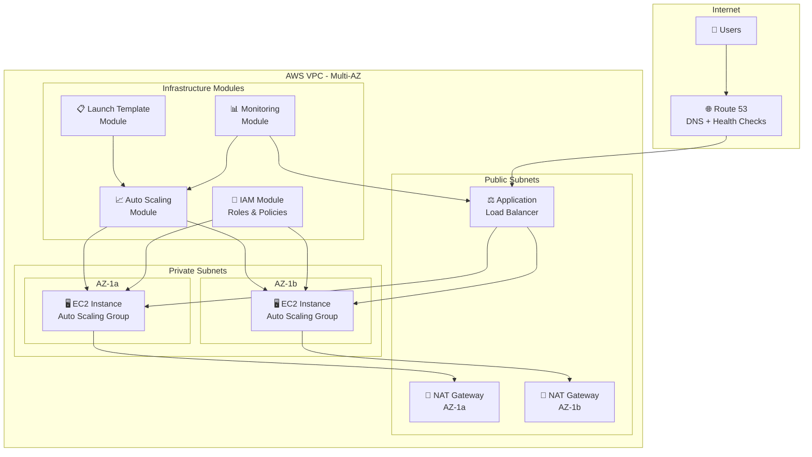
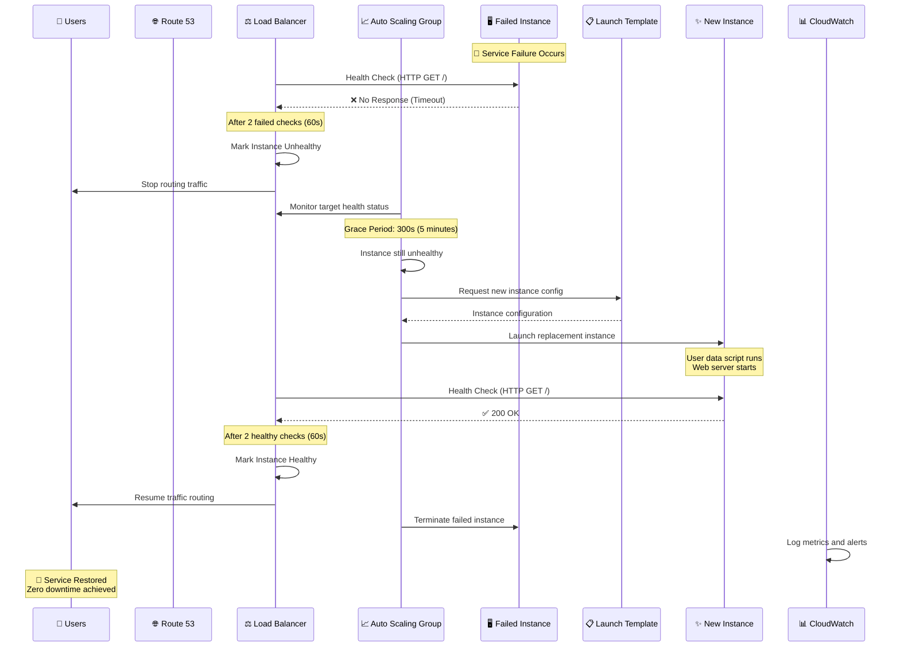
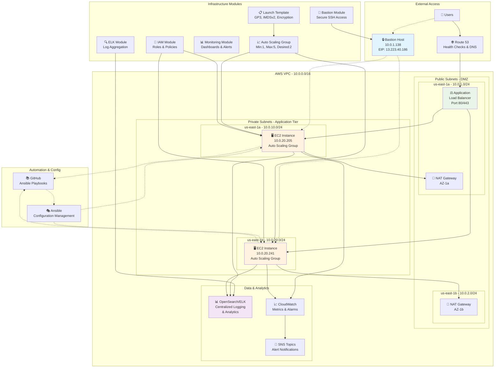
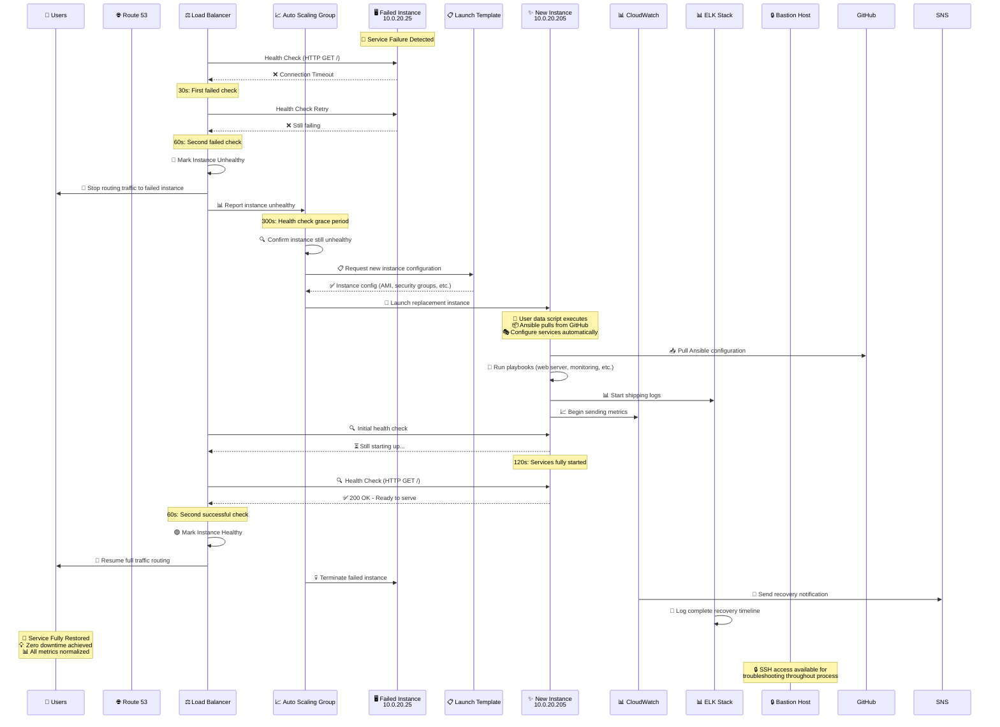
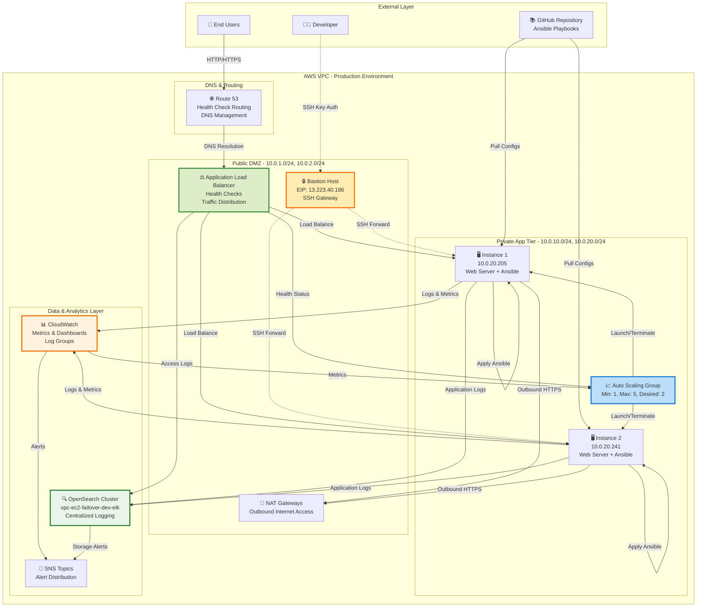
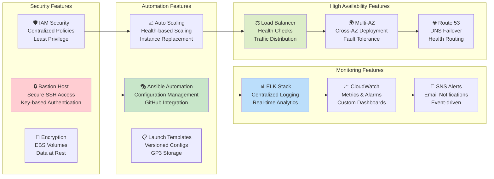

# 🚀 EC2 Failover Infrastructure - Enterprise-Grade AWS Auto Scaling

**Version 2.0** | Last Updated: July 11, 2025 | **Production-Ready**

A **comprehensive, enterprise-grade** Terraform project implementing production-ready AWS infrastructure with **automatic failover**, **multi-layered health checks**, **centralized logging via ELK stack**, **secure bastion access**, and **modular architecture** designed for high availability and DevSecOps best practices.

> **🏆 Featured Architecture**: This project showcases **excellent visualization** and **production-grade design patterns** with comprehensive monitoring, security, and automation capabilities.

## 🎯 Project Features & Capabilities

### 🏗️ **Infrastructure Excellence**
- ✅ **9 Specialized Terraform Modules** - Modular architecture for maintainable infrastructure
- ✅ **Multi-AZ High Availability** - Automatic failover across availability zones with zero downtime
- ✅ **Auto Scaling Groups** - Dynamic scaling based on demand with health monitoring
- ✅ **Application Load Balancer** - Traffic distribution with advanced health checks
- ✅ **Launch Templates** - Versioned instance configurations with GP3 storage

### 🔐 **Security & Access**
- ✅ **Secure Bastion Host** - SSH access to private instances with Elastic IP
- ✅ **IAM Best Practices** - Centralized roles and policies with least privilege
- ✅ **VPC Security Groups** - Granular network access controls between tiers
- ✅ **EBS Encryption** - Encrypted storage volumes with IMDSv2 enforcement
- ✅ **Private Subnets** - Application instances isolated from direct internet access

### 📊 **Monitoring & Observability**
- ✅ **ELK Stack Integration** - Centralized logging with OpenSearch and Kibana dashboards
- ✅ **CloudWatch Monitoring** - Comprehensive metrics, alarms, and dashboards
- ✅ **SNS Notifications** - Email alerts for critical infrastructure events
- ✅ **Multi-Layer Health Checks** - ALB, Route 53, and instance-level monitoring
- ✅ **Cost Tracking** - Resource tagging for detailed cost allocation

### 🎭 **Automation & Configuration**
- ✅ **Ansible Integration** - Complete instance configuration from GitHub repository
- ✅ **GitHub Synchronization** - Daily automated sync of configuration updates
- ✅ **Self-Configuring Instances** - Automatic software installation and service setup
- ✅ **Role-Based Development** - Structured guidance for different engineering disciplines
- ✅ **Idempotent Operations** - Safe, repeatable configuration management

### 🌐 **Networking & DNS**
- ✅ **Route 53 Integration** - DNS management with health check routing
- ✅ **NAT Gateway** - Secure outbound internet access for private instances
- ✅ **Multi-AZ Deployment** - Resources distributed across availability zones
- ✅ **CIDR Management** - Organized subnet allocation and network planning

## 📋 Version History

| Version | Date | Key Features | Status |
|---------|------|--------------|--------|
| **2.0** | July 11, 2025 | ELK Stack, Bastion Host, Enhanced Security, Ansible Automation | ✅ **Current** |
| 1.5 | June 2025 | Modular Architecture, Auto Scaling, Load Balancer Integration | ✅ Stable |
| 1.0 | May 2025 | Basic EC2 Failover, CloudWatch Monitoring, Initial Terraform Setup | ✅ Legacy |

### 🆕 Version 2.0 Features
- **🔍 ELK Stack**: Centralized logging with OpenSearch, Kibana dashboards, and log shipping
- **🏰 Bastion Host**: Secure SSH access with Elastic IP and proper security group configuration
- **🎭 Ansible Integration**: Complete configuration management with GitHub synchronization
- **🔐 Enhanced Security**: IAM centralization, encryption, and DevSecOps best practices
- **📊 Advanced Monitoring**: Multi-layer health checks and comprehensive alerting
- **🏗️ Module Expansion**: 9 specialized modules for enterprise-grade infrastructure

---

## 🏗️ Architecture Overview



## 🔄 Automatic Failover Flow



## 🎨 Architecture Visualization - Excellence in Design

> **🏆 Visual Excellence**: This project features **outstanding architectural visualization** with comprehensive Mermaid diagrams that clearly illustrate complex infrastructure relationships, data flows, and operational procedures.

### 🌟 Complete Infrastructure Diagram



### 🔄 Enhanced Failover & Recovery Visualization



### 🔄 **Complete Data Flow & Integration**



### 🎯 **Feature Integration Map**



---

## 🏗️ Complete Project Structure

```
📁 ec2-failover/                          # 🚀 Enterprise Infrastructure Project
├── 🏛️ modules/                          # 🎯 9 Specialized Infrastructure Modules
│   ├── 🌐 networking/                   # Core VPC Infrastructure
│   │   ├── main.tf                     # VPC, Subnets, NAT, IGW, Security Groups
│   │   ├── variables.tf                # CIDR blocks, AZ configuration
│   │   └── outputs.tf                  # VPC ID, subnet IDs, security group IDs
│   │
│   ├── ⚖️ load_balancer/               # Application Load Balancer
│   │   ├── main.tf                     # ALB, target groups, listeners
│   │   ├── variables.tf                # Health check settings, ports
│   │   └── outputs.tf                  # ALB DNS, target group ARNs
│   │
│   ├── 🌐 route53/                     # DNS Management & Health Checks
│   │   ├── main.tf                     # Hosted zones, health checks
│   │   ├── variables.tf                # Domain configuration
│   │   └── outputs.tf                  # Zone ID, DNS records
│   │
│   ├── 📋 launch_template/             # Instance Configuration Templates
│   │   ├── main.tf                     # Launch template, GP3, IMDSv2, encryption
│   │   ├── variables.tf                # Instance specs, storage, security
│   │   └── outputs.tf                  # Template ID, ARN, versions
│   │
│   ├── 📈 autoscaling/                 # Auto Scaling & Health Management
│   │   ├── main.tf                     # ASG, scaling policies, CloudWatch alarms
│   │   ├── variables.tf                # Min/max size, health check config
│   │   └── outputs.tf                  # ASG details, policy ARNs
│   │
│   ├── 🖥️ ec2/                         # EC2 Instance Management
│   │   ├── main.tf                     # Instance configuration, user data
│   │   ├── variables.tf                # AMI, instance type, key pairs
│   │   └── outputs.tf                  # Instance IDs, private IPs
│   │
│   ├── 🔐 iam/                         # Centralized IAM Security
│   │   ├── main.tf                     # EC2 roles, CloudWatch/SSM policies
│   │   ├── variables.tf                # SNS publishing, environment config
│   │   └── outputs.tf                  # Role ARNs, instance profiles
│   │
│   ├── 🏰 bastion/                     # Secure SSH Access Gateway
│   │   ├── main.tf                     # Bastion instance, EIP, security groups
│   │   ├── variables.tf                # SSH access configuration, key pairs
│   │   ├── outputs.tf                  # Bastion IP, SSH commands
│   │   └── user_data.sh               # Bastion initialization script
│   │
│   ├── 📊 monitoring/                  # CloudWatch & SNS Monitoring
│   │   ├── main.tf                     # CloudWatch alarms, SNS topics
│   │   ├── variables.tf                # Alert thresholds, email config
│   │   └── outputs.tf                  # Alarm ARNs, topic ARNs
│   │
│   └── 🔍 elk/                         # ELK Stack Centralized Logging
│       ├── main.tf                     # OpenSearch cluster, log groups
│       ├── variables.tf                # ELK configuration, retention
│       └── outputs.tf                  # OpenSearch endpoints, Kibana URLs
│
├── 🏢 environments/                     # Multi-Environment Orchestration
│   ├── 🧪 dev/                         # Development Environment
│   │   ├── main.tf                     # Module integration & configuration
│   │   ├── variables.tf                # Environment-specific variables
│   │   ├── outputs.tf                  # Environment outputs
│   │   ├── terraform.tfvars           # Actual variable values
│   │   ├── terraform.tfvars.example   # Template for configuration
│   │   └── terraform.tfstate          # State management
│   │
│   ├── 🎭 staging/                     # Staging Environment (Template)
│   └── 🏭 prod/                        # Production Environment (Template)
│
├── 🎭 ansible/                         # Configuration Management
│   ├── 📝 playbooks/                   # Ansible Playbooks
│   │   └── site.yml                   # Main configuration playbook
│   ├── 🎯 roles/                       # Modular Ansible Roles
│   │   ├── common/                     # Base system configuration
│   │   ├── webserver/                  # Apache/Nginx setup
│   │   ├── monitoring/                 # CloudWatch agent
│   │   ├── docker/                     # Container runtime
│   │   ├── nodejs/                     # Node.js applications
│   │   └── security/                   # Security hardening
│   ├── 📋 group_vars/                  # Global variables
│   ├── 🗂️ inventory/                   # Host inventories
│   ├── 📄 templates/                   # Configuration templates
│   ├── ⚙️ ansible.cfg                 # Ansible configuration
│   ├── 🔄 run-playbook.sh             # Playbook execution script
│   └── 📥 sync-from-github.sh         # GitHub synchronization
│
├── 🔧 scripts/                         # Automation & Deployment Scripts
│   ├── 🚀 deploy.sh                   # Complete infrastructure deployment
│   ├── 🧹 cleanup.sh                  # Resource cleanup and teardown
│   └── 🔍 health-check.sh            # Infrastructure health validation
│
├── 📚 docs/                            # Comprehensive Documentation
│   ├── 🏗️ architecture.md             # Detailed architecture decisions
│   ├── 💰 cost.md                     # Cost analysis & optimization
│   ├── 🚀 getting-started.md          # Setup and deployment guide
│   ├── 🔒 security.md                 # Security best practices
│   ├── 📊 monitoring.md               # Monitoring and alerting guide
│   └── 📝 change_log.md               # Version history and changes
│
├── 🎭 copilot_roles/                   # Role-Based Development Guidance
│   ├── 🏗️ aws_architect.md            # Infrastructure design guidance
│   ├── 🔧 sre.md                      # Site reliability engineering
│   ├── 🔐 devsecops.md                # Security & compliance practices
│   ├── 👨‍💻 devops_engineer.md           # Deployment & automation
│   ├── 🐧 linux_admin.md              # System administration
│   ├── 🐍 python_dev.md               # Python development practices
│   └── 📊 logging.md                  # Logging and monitoring
│
├── 📄 README.md                       # 📖 This comprehensive guide
├── 🔧 Makefile                        # Build automation commands
├── 📦 versions.tf                     # Terraform version constraints
└── ⚙️ .gitignore                      # Git ignore patterns

🎯 Total: 9 Infrastructure Modules | 60+ Configuration Files | Production-Ready
```


