# 🚀 EC2 Failover Infrastructure - Production-Ready AWS Auto Scaling

A comprehensive, modular Terraform project implementing production-grade AWS infrastructure with **automatic failover**, **multi-layered health checks**, and **high availability** across multiple modules.

## 🏗️ Architecture Overview

```mermaid
graph TB
    subgraph "Internet"
        Users[👥 Users]
        DNS[🌐 Route 53<br/>DNS + Health Checks]
    end
    
    subgraph "AWS VPC - Multi-AZ"
        subgraph "Public Subnets"
            ALB[⚖️ Application<br/>Load Balancer]
            NAT1[🔀 NAT Gateway<br/>AZ-1a]
            NAT2[🔀 NAT Gateway<br/>AZ-1b]
        end
        
        subgraph "Private Subnets"
            subgraph "AZ-1a"
                EC2_1[🖥️ EC2 Instance<br/>Auto Scaling Group]
            end
            subgraph "AZ-1b" 
                EC2_2[🖥️ EC2 Instance<br/>Auto Scaling Group]
            end
        end
        
        subgraph "Infrastructure Modules"
            LT[📋 Launch Template<br/>Module]
            ASG[📈 Auto Scaling<br/>Module]
            IAM[🔐 IAM Module<br/>Roles & Policies]
            MON[📊 Monitoring<br/>Module]
        end
    end
    
    Users --> DNS
    DNS --> ALB
    ALB --> EC2_1
    ALB --> EC2_2
    
    LT --> ASG
    ASG --> EC2_1
    ASG --> EC2_2
    IAM --> EC2_1
    IAM --> EC2_2
    MON --> ALB
    MON --> ASG
    
    EC2_1 --> NAT1
    EC2_2 --> NAT2
```



## 🔄 Automatic Failover Flow

```mermaid
sequenceDiagram
    participant User as 👥 Users
    participant R53 as 🌐 Route 53
    participant ALB as ⚖️ Load Balancer
    participant ASG as 📈 Auto Scaling Group
    participant EC2_OLD as 🖥️ Failed Instance
    participant LT as 📋 Launch Template
    participant EC2_NEW as ✨ New Instance
    participant CW as 📊 CloudWatch

    Note over EC2_OLD: 🚨 Service Failure Occurs
    
    ALB->>EC2_OLD: Health Check (HTTP GET /)
    EC2_OLD-->>ALB: ❌ No Response (Timeout)
    
    Note over ALB: After 2 failed checks (60s)
    ALB->>ALB: Mark Instance Unhealthy
    ALB->>User: Stop routing traffic
    
    ASG->>ALB: Monitor target health status
    Note over ASG: Grace Period: 300s (5 minutes)
    ASG->>ASG: Instance still unhealthy
    
    ASG->>LT: Request new instance config
    LT-->>ASG: Instance configuration
    ASG->>EC2_NEW: Launch replacement instance
    
    Note over EC2_NEW: User data script runs<br/>Web server starts
    
    ALB->>EC2_NEW: Health Check (HTTP GET /)
    EC2_NEW-->>ALB: ✅ 200 OK
    
    Note over ALB: After 2 healthy checks (60s)
    ALB->>ALB: Mark Instance Healthy
    ALB->>User: Resume traffic routing
    
    ASG->>EC2_OLD: Terminate failed instance
    CW->>CW: Log metrics and alerts
    
    Note over User: 🎉 Service Restored<br/>Zero downtime achieved
```



## 🏛️ Modular Architecture

```
📁 ec2-failover/
├── 🏗️ modules/                    # Modular Infrastructure Components
│   ├── 📋 launch_template/        # 🎯 Instance Configuration
│   │   ├── main.tf               # Launch template with GP3, IMDSv2, encryption
│   │   ├── variables.tf          # Instance specs, storage, security config
│   │   └── outputs.tf            # Template ID, ARN, versions
│   │
│   ├── 📈 autoscaling/           # 🔄 Scaling & Health Management  
│   │   ├── main.tf               # ASG, scaling policies, CloudWatch alarms
│   │   ├── variables.tf          # Min/max size, health check config
│   │   └── outputs.tf            # ASG details, policy ARNs
│   │
│   ├── 🔐 iam/                   # 🛡️ Security & Permissions
│   │   ├── main.tf               # EC2 roles, CloudWatch/SSM policies
│   │   ├── variables.tf          # SNS publishing, environment config
│   │   └── outputs.tf            # Role ARNs, instance profile
│   │
│   ├── 🌐 networking/            # 🏠 Network Foundation
│   │   ├── main.tf               # VPC, subnets, NAT, security groups
│   │   ├── variables.tf          # CIDR blocks, AZ configuration
│   │   └── outputs.tf            # VPC ID, subnet IDs, security groups
│   │
│   ├── ⚖️ load_balancer/         # 🔀 Traffic Distribution
│   │   ├── main.tf               # ALB, target groups, listeners
│   │   ├── variables.tf          # Health check settings, ports
│   │   └── outputs.tf            # ALB DNS, target group ARNs
│   │
│   ├── 🌐 route53/               # 📍 DNS Management
│   │   ├── main.tf               # Hosted zones, health checks
│   │   ├── variables.tf          # Domain configuration
│   │   └── outputs.tf            # Zone ID, DNS records
│   │
│   └── 📊 monitoring/            # 👁️ Observability
│       ├── main.tf               # CloudWatch alarms, SNS topics
│       ├── variables.tf          # Alert thresholds, email config
│       └── outputs.tf            # Alarm ARNs, topic ARNs
│
├── 🏢 environments/              # Environment-Specific Orchestration
│   ├── 🧪 dev/                   # Development Environment
│   │   ├── main.tf               # Module integration & configuration
│   │   ├── variables.tf          # Environment-specific values
│   │   ├── outputs.tf            # Environment outputs
│   │   └── terraform.tfvars      # Actual variable values
│   │
│   ├── 🎭 staging/               # Staging Environment
│   └── 🏭 prod/                  # Production Environment
│
├── 🔧 scripts/                   # Automation Scripts
│   ├── deploy.sh                 # Infrastructure deployment
│   └── cleanup.sh               # Resource cleanup
│
├── 📚 docs/                      # Comprehensive Documentation
│   ├── architecture.md          # Detailed architecture decisions
│   ├── cost.md                  # Cost analysis & optimization
│   ├── getting-started.md       # Setup instructions
│   └── change_log.md            # Change tracking
│
└── 🎭 copilot_roles/            # Role-Based Development System
    ├── aws_architect.md         # Infrastructure design guidance
    ├── sre.md                   # Site reliability engineering
    ├── devsecops.md             # Security & compliance
    └── devops_engineer.md       # Deployment & automation
```

## ✨ Key Features

### 🎯 **Production-Ready Infrastructure**
- **Multi-AZ Deployment**: Instances distributed across availability zones
- **Auto Scaling Groups**: Automatic instance replacement on failure
- **Launch Templates**: Consistent instance configuration with versioning
- **Load Balancer Integration**: Application Load Balancer with health checks
- **Private Subnets**: EC2 instances in private subnets with NAT Gateway access

### 🛡️ **Security & Compliance**
- **IAM Best Practices**: Least privilege roles and policies
- **EBS Encryption**: Encrypted root volumes with optional KMS keys
- **IMDSv2 Enforcement**: Instance metadata service v2 for enhanced security
- **Security Groups**: Granular network access controls
- **VPC Flow Logs**: Network traffic monitoring (optional)

### 📊 **Monitoring & Observability**
- **Multi-Layer Health Checks**: ALB, Route 53, and CloudWatch monitoring
- **CloudWatch Alarms**: CPU, memory, and custom metric monitoring
- **SNS Notifications**: Email alerts for critical events
- **Auto Scaling Metrics**: Detailed scaling activity monitoring
- **Cost Tracking**: Resource tagging for cost allocation

### 🔄 **High Availability & Failover**
- **Automatic Instance Replacement**: Failed instances replaced within 5-8 minutes
- **Zero-Downtime Deployments**: Rolling updates with instance refresh
- **Cross-AZ Redundancy**: Multi-availability zone deployment
- **Health Check Grace Period**: Configurable startup time for applications
- **Scaling Policies**: CPU-based automatic scaling (optional)

### 🏗️ **Modular Design**
- **Separation of Concerns**: Each module handles specific functionality
- **Reusable Components**: Modules can be used across environments
- **Environment Isolation**: Dev, staging, and production configurations
- **Version Control**: Launch template versioning for rollbacks

### ⚡ **Ansible Automation**
- **Infrastructure as Code**: Automated instance configuration via Ansible
- **GitHub Integration**: Playbooks and roles managed in version control
- **Self-Configuring Instances**: Automatic software installation and setup
- **Idempotent Operations**: Safe to run configuration multiple times
- **Centralized Management**: All configuration pulled from GitHub repository
- **Continuous Updates**: Automated daily sync and configuration updates

## 🎭 Ansible Configuration Management

The infrastructure includes integrated Ansible automation for complete instance configuration:

```mermaid
graph LR
    subgraph "EC2 Instance Boot"
        Boot[🚀 Instance Starts] --> Install[📦 Install Ansible]
        Install --> Config[⚙️ Basic Config]
        Config --> GitHub[📥 Pull from GitHub]
    end
    
    subgraph "GitHub Repository"
        Repo[📚 Ansible Repo] --> Playbooks[📝 Playbooks]
        Repo --> Roles[🎭 Roles]
        Repo --> Vars[📋 Variables]
    end
    
    subgraph "Configuration"
        GitHub --> Run[▶️ Run Playbooks]
        Run --> Services[🔧 Configure Services]
        Services --> Monitor[📊 Enable Monitoring]
    end
    
    Monitor --> Cron[⏰ Daily Updates]
    Cron --> GitHub
```



### Key Ansible Features:
- **🔄 Automatic Setup**: Ansible installed and configured during instance boot
- **📦 GitHub Integration**: All playbooks, roles, and configurations pulled from your repository
- **🎯 Localhost Execution**: Runs locally on each instance for self-configuration
- **📅 Scheduled Updates**: Daily cron job syncs latest configurations
- **📊 Comprehensive Logging**: All activities logged to CloudWatch and local files

### Required GitHub Repository Structure:
```
your-ansible-repo/
├── playbooks/
│   └── site.yml              # Main configuration playbook
├── roles/
│   ├── common/              # Basic system setup
│   ├── webserver/           # Web server configuration  
│   ├── monitoring/          # CloudWatch and logging
│   └── docker/              # Container runtime
├── group_vars/
│   └── all.yml              # Global configuration variables
└── inventory/
    └── hosts                # Optional: merge with local inventory
```

**📚 Complete documentation**: See [docs/ansible-integration.md](docs/ansible-integration.md) for detailed setup instructions and examples.

## 🔧 Prerequisites

- **AWS CLI** configured with appropriate credentials
- **Terraform** >= 1.0
- **Git** for version control
- **IAM permissions** for EC2, VPC, ELB, Route 53, CloudWatch

## 🚀 Quick Start

### 1. Clone and Setup
```bash
git clone https://github.com/your-repo/ec2-failover.git
cd ec2-failover
```

### 2. Configure Environment
```bash
cd environments/dev
cp terraform.tfvars.example terraform.tfvars
# Edit terraform.tfvars with your settings
```

### 3. Deploy Infrastructure
```bash
terraform init
terraform plan
terraform apply
```

### 4. Access Your Application
```bash
# Get the load balancer DNS name
terraform output load_balancer_dns

# Test the application
curl http://your-load-balancer-dns/
```

### 5. Configure Ansible Automation (Optional)
```bash
# SSH into an instance
ssh -i your-key.pem ec2-user@instance-ip

# Update GitHub repository URL
sudo nano /opt/ansible/sync-from-github.sh
# Change: GITHUB_REPO="https://github.com/YOUR_USERNAME/YOUR_ANSIBLE_REPO.git"

# Sync your Ansible configuration
sudo /opt/ansible/sync-from-github.sh

# Run your playbooks
sudo /opt/ansible/run-playbook.sh
```

## 🧪 Testing Failover

### Simulate Instance Failure
```bash
# Get instance IDs
aws ec2 describe-instances --filters "Name=tag:Name,Values=*asg-instance*" \
  --query 'Reservations[].Instances[].InstanceId'

# Terminate an instance to test failover
aws ec2 terminate-instances --instance-ids i-1234567890abcdef0

# Monitor the replacement process
watch -n 10 'aws autoscaling describe-auto-scaling-groups \
  --auto-scaling-group-names ec2-failover-dev-asg \
  --query "AutoScalingGroups[0].Instances[*].[InstanceId,LifecycleState,HealthStatus]"'
```

### Monitor Health Checks
```bash
# Check ALB target health
aws elbv2 describe-target-health \
  --target-group-arn your-target-group-arn

# View CloudWatch metrics
aws cloudwatch get-metric-statistics \
  --namespace AWS/AutoScaling \
  --metric-name GroupDesiredCapacity \
  --dimensions Name=AutoScalingGroupName,Value=ec2-failover-dev-asg \
  --start-time 2024-01-01T00:00:00Z \
  --end-time 2024-01-01T23:59:59Z \
  --period 300 \
  --statistics Average
```

## 💰 Cost Optimization

### Development Environment (~$76/month)
```
Component                Cost/Month
├── EC2 (2x t3.micro)     ~$15.68
├── EBS (2x 8GB gp3)      ~$1.60
├── ALB                   ~$22.00
├── NAT Gateway           ~$32.85
├── CloudWatch            ~$3.00
└── Data Transfer         ~$1.00
```

### Production Environment (~$124/month)
```
Component                Cost/Month
├── EC2 (2x t3.small)     ~$31.36
├── EBS (2x 20GB gp3)     ~$4.00
├── ALB                   ~$22.00
├── NAT Gateway           ~$32.85
├── Route 53              ~$0.50
├── CloudWatch            ~$8.00
├── SNS                   ~$0.50
└── Data Transfer         ~$25.00
```

**Cost Optimization Tips:**
- Use AWS Free Tier for development
- Schedule instances for testing environments
- Implement lifecycle policies for log retention
- Monitor unused resources with AWS Cost Explorer

## 📊 Health Check Configuration

### ALB Health Check Settings
```hcl
health_check {
  enabled             = true
  healthy_threshold   = 2      # 2 successful checks = healthy
  unhealthy_threshold = 2      # 2 failed checks = unhealthy  
  timeout             = 5      # 5 second timeout
  interval            = 30     # Check every 30 seconds
  path                = "/"    # Health check endpoint
  matcher             = "200"  # Expected HTTP status
  port                = "traffic-port"
  protocol            = "HTTP"
}
```

### Auto Scaling Health Check
```hcl
resource "aws_autoscaling_group" "main" {
  health_check_type         = "ELB"  # Use ELB health status
  health_check_grace_period = 300    # 5 minutes for startup
  
  # Instance replacement timeline:
  # 0s:    Instance failure occurs
  # 30s:   First failed health check
  # 60s:   Second failed health check → Instance marked unhealthy
  # 360s:  Grace period expires → ASG triggers replacement
  # 420s:  New instance launched
  # 480s:  New instance ready and healthy
}
```

## 🔍 Monitoring Dashboard

### CloudWatch Metrics to Monitor
```bash
# Auto Scaling Group Metrics
- GroupMinSize, GroupMaxSize, GroupDesiredCapacity
- GroupInServiceInstances, GroupPendingInstances
- GroupStandbyInstances, GroupTerminatingInstances
- GroupTotalInstances

# ALB Metrics  
- TargetResponseTime, RequestCount
- HTTPCode_Target_2XX_Count, HTTPCode_Target_5XX_Count
- HealthyHostCount, UnHealthyHostCount

# EC2 Instance Metrics
- CPUUtilization, NetworkIn, NetworkOut
- StatusCheckFailed, StatusCheckFailed_Instance
- StatusCheckFailed_System
```

### Setting Up Alerts
```bash
# High CPU Alert
aws cloudwatch put-metric-alarm \
  --alarm-name "HighCPU-ASG" \
  --alarm-description "Alert when CPU exceeds 80%" \
  --metric-name CPUUtilization \
  --namespace AWS/EC2 \
  --statistic Average \
  --period 300 \
  --threshold 80 \
  --comparison-operator GreaterThanThreshold \
  --evaluation-periods 2

# Unhealthy Targets Alert  
aws cloudwatch put-metric-alarm \
  --alarm-name "UnhealthyTargets-ALB" \
  --alarm-description "Alert when targets are unhealthy" \
  --metric-name UnHealthyHostCount \
  --namespace AWS/ApplicationELB \
  --statistic Average \
  --period 60 \
  --threshold 1 \
  --comparison-operator GreaterThanOrEqualToThreshold \
  --evaluation-periods 1
```

## 🔧 Module Configuration Examples

### Launch Template Module
```hcl
module "launch_template" {
  source = "../../modules/launch_template"

  project_name                = "ec2-failover-dev"
  environment                = "dev"
  ami_id                     = "ami-0abcdef1234567890"
  instance_type              = "t3.micro"
  key_name                   = "my-key-pair"
  security_group_ids         = ["sg-12345678"]
  iam_instance_profile_name  = "ec2-role-profile"
  
  # Storage configuration
  root_volume_type          = "gp3"
  root_volume_size          = 8
  enable_ebs_encryption     = true
  
  # Monitoring
  enable_detailed_monitoring = false
  
  # User data for web server setup
  user_data = <<-EOF
    #!/bin/bash
    yum update -y
    yum install -y httpd
    systemctl start httpd
    systemctl enable httpd
    echo "<h1>Auto Scaling Instance</h1>" > /var/www/html/index.html
  EOF
}
```

### Auto Scaling Module
```hcl
module "autoscaling" {
  source = "../../modules/autoscaling"

  project_name           = "ec2-failover-dev"
  environment           = "dev"
  launch_template_id    = module.launch_template.launch_template_id
  subnet_ids            = ["subnet-12345", "subnet-67890"]
  target_group_arns     = ["arn:aws:elasticloadbalancing:..."]
  
  # Scaling configuration
  min_size                  = 1
  max_size                  = 5
  desired_capacity          = 2
  
  # Health checks
  health_check_type         = "ELB"
  health_check_grace_period = 300
  
  # Auto scaling policies
  enable_scaling_policies   = true
}
```

## 🚨 Troubleshooting

### Common Issues

**1. Instances Not Healthy**
```bash
# Check ALB target health
aws elbv2 describe-target-health --target-group-arn YOUR_TG_ARN

# Check security group rules
aws ec2 describe-security-groups --group-ids sg-12345678

# Check user data logs
sudo tail -f /var/log/cloud-init-output.log
```

**2. Auto Scaling Not Working**
```bash
# Check ASG activity
aws autoscaling describe-scaling-activities \
  --auto-scaling-group-name ec2-failover-dev-asg

# Check ASG health check settings
aws autoscaling describe-auto-scaling-groups \
  --auto-scaling-group-names ec2-failover-dev-asg
```

**3. High Costs**
```bash
# Check running instances
aws ec2 describe-instances --filters "Name=instance-state-name,Values=running"

# Check NAT Gateway usage
aws ec2 describe-nat-gateways

# Review CloudWatch billing alarms
aws cloudwatch describe-alarms --alarm-name-prefix "billing"
```

## 🔐 Security Best Practices

### Implemented Security Features
- ✅ **IMDSv2 Enforcement**: Prevents SSRF attacks on instance metadata
- ✅ **EBS Encryption**: All volumes encrypted at rest
- ✅ **Private Subnets**: EC2 instances not directly accessible from internet
- ✅ **Least Privilege IAM**: Minimal required permissions
- ✅ **Security Groups**: Restrictive network access rules
- ✅ **NAT Gateway**: Secure outbound internet access

### Additional Security Recommendations
```bash
# Enable VPC Flow Logs
aws ec2 create-flow-logs \
  --resource-type VPC \
  --resource-ids vpc-12345678 \
  --traffic-type ALL \
  --log-destination-type cloud-watch-logs \
  --log-group-name VPCFlowLogs

# Enable CloudTrail
aws cloudtrail create-trail \
  --name ec2-failover-trail \
  --s3-bucket-name your-cloudtrail-bucket

# Enable GuardDuty
aws guardduty create-detector --enable
```

## 📈 Scaling Strategies

### Horizontal Scaling (Auto Scaling)
```hcl
# CPU-based scaling
resource "aws_autoscaling_policy" "scale_up" {
  name                   = "scale-up"
  scaling_adjustment     = 1
  adjustment_type        = "ChangeInCapacity"
  cooldown               = 300
  autoscaling_group_name = aws_autoscaling_group.main.name
}

# CloudWatch alarm for scaling
resource "aws_cloudwatch_metric_alarm" "high_cpu" {
  alarm_name          = "high-cpu"
  comparison_operator = "GreaterThanThreshold"
  evaluation_periods  = "2"
  metric_name         = "CPUUtilization"
  namespace           = "AWS/EC2"
  period              = "120"
  statistic           = "Average"
  threshold           = "70"
  alarm_actions       = [aws_autoscaling_policy.scale_up.arn]
}
```

### Vertical Scaling (Instance Types)
```bash
# Upgrade instance types in launch template
# Update desired_capacity to trigger instance refresh
terraform apply -var="instance_type=t3.small"
```

## 🎯 Performance Optimization

### Launch Template Optimizations
- **GP3 Storage**: Better IOPS and throughput than GP2
- **IMDSv2**: Improved security with negligible performance impact  
- **User Data Optimization**: Minimal startup scripts for faster boot
- **Instance Warmup**: Configured grace periods for application startup

### Auto Scaling Optimizations
- **Health Check Grace Period**: 300 seconds for application warmup
- **Instance Refresh**: Rolling updates with 50% minimum healthy percentage
- **Scaling Cooldowns**: Prevent thrashing during scaling events
- **Multi-AZ Distribution**: Even distribution across availability zones

## 🔄 Disaster Recovery

### Backup Strategy
```bash
# Automated EBS snapshots
aws dlm create-lifecycle-policy \
  --description "Daily EBS snapshots" \
  --state ENABLED \
  --execution-role-arn arn:aws:iam::account:role/AWSDataLifecycleManagerDefaultRole

# AMI backup for launch template
aws ec2 create-image \
  --instance-id i-1234567890abcdef0 \
  --name "backup-$(date +%Y%m%d)" \
  --description "Backup AMI for disaster recovery"
```

### Multi-Region Setup
```hcl
# Configure multiple providers for multi-region deployment
provider "aws" {
  alias  = "primary"
  region = "us-east-1"
}

provider "aws" {
  alias  = "backup"  
  region = "us-west-2"
}
```

## 📚 Additional Resources

### Documentation Links
- [📖 Architecture Deep Dive](docs/architecture.md)
- [💰 Cost Analysis](docs/cost.md)
- [🚀 Getting Started Guide](docs/getting-started.md)
- [📝 Change Log](docs/change_log.md)

### AWS Services Used
- **EC2**: Virtual servers with auto scaling
- **VPC**: Virtual private cloud with public/private subnets
- **ELB**: Application load balancer for traffic distribution
- **Route 53**: DNS management and health checks
- **CloudWatch**: Monitoring, logging, and alerting
- **IAM**: Identity and access management
- **SNS**: Simple notification service for alerts

### Community & Support
- 🐛 [Report Issues](https://github.com/your-repo/ec2-failover/issues)
- 💬 [Discussions](https://github.com/your-repo/ec2-failover/discussions)
- 📧 [Contact](mailto:your-email@domain.com)

## 📄 License

This project is licensed under the MIT License - see the [LICENSE](LICENSE) file for details.

## 🙏 Contributing

1. Fork the repository
2. Create a feature branch (`git checkout -b feature/amazing-feature`)
3. Commit your changes (`git commit -m 'Add amazing feature'`)
4. Push to the branch (`git push origin feature/amazing-feature`)
5. Open a Pull Request

---

**🎉 Happy Infrastructure Automation!** 

*Built with ❤️ for reliable, scalable, and cost-effective AWS infrastructure.*


